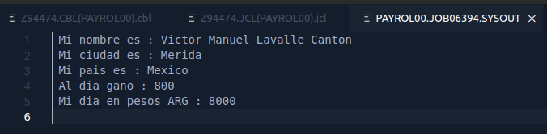

# PRÁCTICA 1 - ACADEMIA COBOL

Víctor Manuel Lavalle Cantón

### Código fuente

```cobol
      *-----------------------
       IDENTIFICATION DIVISION.
      *-----------------------
       PROGRAM-ID. PAYROL00.
      *-------------
       DATA DIVISION.                                                   
      *-------------
       WORKING-STORAGE SECTION.
      ****** Variables para imprimir
       77 WSV-NOMBRE              PIC X(40).
       77 WSV-CIUDAD              PIC X(20).
       77 WSV-PAIS                PIC X(20).
       77 WSV-SAL-DIARIO          PIC 9(03).
       77 WSV-SAL-DIARIO-ARG      PIC 9(04).
       77 WSV-PAGO-POR-HORA       PIC 9(03).
       77 WSV-HORAS               PIC 9(02).
      ****** Constantes para hacer calculos
       77 WSC-PESO-ARG            PIC 9(02) VALUE 10.      

      *------------------
       PROCEDURE DIVISION.
      *------------------
      ****** COBOL MOVE statements - Literal Text to Variables
           MOVE "Victor Manuel Lavalle Canton" TO WSV-NOMBRE.
           MOVE "Merida" TO WSV-CIUDAD.
           MOVE "Mexico" TO WSV-PAIS.
           MOVE 100 TO WSV-PAGO-POR-HORA.
           MOVE 8 TO WSV-HORAS.
           COMPUTE WSV-SAL-DIARIO = WSV-PAGO-POR-HORA * WSV-HORAS.
           COMPUTE WSV-SAL-DIARIO-ARG = WSV-SAL-DIARIO * WSC-PESO-ARG.

      ****** DISPLAY statements
           DISPLAY "Mi nombre es : " WSV-NOMBRE.
           DISPLAY "Mi ciudad es : " WSV-CIUDAD.
           DISPLAY "Mi pais es : " WSV-PAIS.
           DISPLAY "Al dia gano : " WSV-SAL-DIARIO.
           DISPLAY "Mi dia en pesos ARG : " WSV-SAL-DIARIO-ARG.
           GOBACK.
```


### Evidencia

