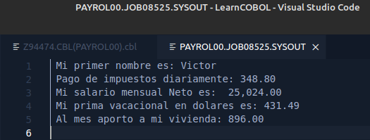

# Práctica 3 - Academia Cobol 2023

***Alumno:** Víctor Manuel Lavalle Cantón*

***Instructor:** Héctor Camacho*


## Instrucciones

Hacer un programa COBOL que muestre los siguientes datos en el spool :

* Primer Nombre : 

* Impuestos diarios son : 

* Salario Mensual Neto es : 

* Mi prima vacacional en dólares es : 

*  Al mes aporto a mi vivienda : 

  

Teniendo en cuenta las siguientes cuestiones funcionales:

* Me pagan 200 pesos brutos la hora.

* Trabajo 8 horas por día. 

* El mes tiene 20 días hábiles de trabajo. 

* El sueldo Neto es el salario bruto menos los descuentos de ISR e IMSS. 

* Sobre mi sueldo bruto me descuentan el 16% de ISR. 

* Sobre mi sueldo bruto me descuentan el 5.8% de IMSS (3% de retiro, 2.8% para vivienda). 

* El dólar está en 18.54 pesos Mexicanos. 

* Las aportaciones al IMSS son aportaciones del salario bruto. 

* Su prima vacacional es del 25% de su salario Mensual bruto

  

Teniendo en cuenta las siguientes cuestiones técnicas: 

* NO aceptare programas con código duro, todas las operaciones matemáticas tienen que ser constantes o variables.
* Un programa SIN buenas prácticas de programación resta puntos (Modulacion,Legilibilidad de código, Identacion, NO Código muerto) 
*  Todos los resultados deben mostrarse con mascaras es decir con dos decimales ejemplo 100.00


## Resultados

### Código Fuente

```cobol
      *-----------------------
       IDENTIFICATION DIVISION.
      *-----------------------
       PROGRAM-ID. PAYROL00.
      *-------------
       DATA DIVISION.
      *-------------
       WORKING-STORAGE SECTION.

      ****** Variables
       01 VARIABLES.
          10 WSV-PRIMER-NOMBRE     PIC X(15)      VALUE SPACES.
          10 WSV-PRIMA-VACA        PIC 9(05)V99.
          10 WSV-SAL-DIARIO        PIC 9(06)V99.
          10 WSV-SAL-MES-BRUT      PIC 9(05)V99.
          10 WSV-SAL-MENSUAL-NETO  PIC 9(05)V99.
          10 WSV-IMPSTOS-DIARIO    PIC 9(04)V99.
          10 WSV-IMP-ISR           PIC 9(05)V99.
          10 WSV-IMP-IMSS.
             15 WSV-IMP-IMSS-RET   PIC 9(05)V99.
             15 WSV-IMP-IMSS-VIV   PIC 9(05)V99.


      ****** Constantes para hacer calculos
       01 CONSTANTES.
          10 WSC-HORAS             PIC 9(02).
          10 WSC-PAGO-POR-HORA     PIC 9(03).
          10 WSC-DIAS-HABILES      PIC 9(02)      VALUE 20.
          10 WSC-IVA               PIC 9(01)V99   VALUE 0.16.
          10 WSC-USD-MXN           PIC 9(02)V99   VALUE 18.54.
          10 WSC-PERC-PRIMA-VACA   PIC 9(01)V99   VALUE 0.25.
          10 WSC-PERC-IMSS-RET     PIC 9(01)V99   VALUE 0.03.
          10 WSC-PERC-IMSS-VIV     PIC 9(01)V999  VALUE 0.028.


      ****** Mascaras
       01 MASCARAS.
          10 WSV-MASK-IMP-DIARIO   PIC ZZ9.99.
          10 WSV-MASK-PRIMA-VAC    PIC ZZ9.99.
          10 WSV-MASK-IMP-MES-VIV  PIC ZZ9.99.
          10 WSV-MASK-SAL-NETO     PIC ZZZ,ZZ9.99.


      *------------------
       PROCEDURE DIVISION.
      *------------------
      ******Asignación de valores para los calculos - MOVE statements
           MOVE "Victor" TO WSV-PRIMER-NOMBRE.
           MOVE 200 TO WSC-PAGO-POR-HORA.
           MOVE 8 TO WSC-HORAS.


      ***** Calculo del salario diario y bruto
           COMPUTE WSV-SAL-DIARIO = WSC-PAGO-POR-HORA * WSC-HORAS.

           COMPUTE WSV-SAL-MES-BRUT = WSV-SAL-DIARIO * WSC-DIAS-HABILES.


      ****** Calculo de ISR
           COMPUTE WSV-IMP-ISR =(WSV-SAL-MES-BRUT * WSC-IVA).


      ***** Calculo de IMSS
           COMPUTE WSV-IMP-IMSS-RET =
              (WSV-SAL-MES-BRUT * WSC-PERC-IMSS-RET).

           COMPUTE WSV-IMP-IMSS-VIV =
              (WSV-SAL-MES-BRUT * WSC-PERC-IMSS-VIV).


      ***** Calculo de salario mensual neto
           COMPUTE WSV-SAL-MENSUAL-NETO =
              (WSV-SAL-MES-BRUT - WSV-IMP-ISR) -
              (WSV-IMP-IMSS-RET + WSV-IMP-IMSS-VIV).


      ***** Calculo de prima vacacional
           COMPUTE WSV-PRIMA-VACA =
              (WSV-SAL-MES-BRUT * WSC-PERC-PRIMA-VACA) / WSC-USD-MXN.


      ***** Calculo de impuestos diarios
           COMPUTE WSV-IMPSTOS-DIARIO =
              (WSV-IMP-ISR + WSV-IMP-IMSS-RET + WSV-IMP-IMSS-VIV)
              / WSC-DIAS-HABILES.


      ***** Asignación de valores a las mascaras - MOVE statements
           MOVE WSV-SAL-MENSUAL-NETO TO WSV-MASK-SAL-NETO.
           MOVE WSV-PRIMA-VACA TO WSV-MASK-PRIMA-VAC.
           MOVE WSV-IMPSTOS-DIARIO TO WSV-MASK-IMP-DIARIO.
           MOVE WSV-IMP-IMSS-VIV TO WSV-MASK-IMP-MES-VIV.


      ****** DISPLAY statements
           DISPLAY "Mi primer nombre es: " WSV-PRIMER-NOMBRE.
      *
           DISPLAY "Pago de impuestos diariamente: "
                   WSV-MASK-IMP-DIARIO.
      *
           DISPLAY "Mi salario mensual Neto es: "
                   WSV-MASK-SAL-NETO.
      *
           DISPLAY "Mi prima vacacional en dolares es: "
                   WSV-MASK-PRIMA-VAC.

           DISPLAY "Al mes aporto a mi vivienda: "
                   WSV-MASK-IMP-MES-VIV.
      *
           GOBACK.

```


### Salida



