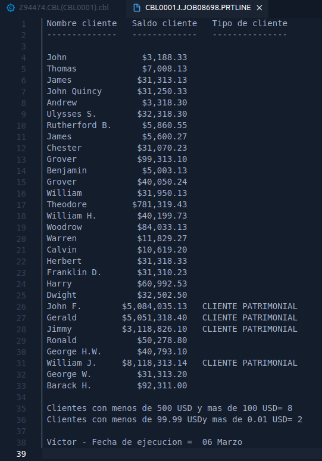

# Práctica 5

***Alumno:** Víctor Lavalle*

***Instructor:** Héctor Camacho*


## Código Fuente

```cobol
      *----------------------------------------------------------------*
       IDENTIFICATION DIVISION.
      *-----------------------
       PROGRAM-ID.     CBL0001
       AUTHOR.         Victor Lavalle.
       DATE-WRITTEN    FEBRERO 2022.

      *________________________________________________________________*
      *                                                                *
      *                     "PRACTICA 5"                               *
      *                                                                *
      * Instrucciones: Hacer un programa Cobol que genere un archivo   *
      *          con Nombre del cliente, Saldo en USD                  *
      *          y Tipo de cliente                                     *
      *                                                                *
      *________________________________________________________________*


      *----------------------------------------------------------------*
       ENVIRONMENT DIVISION.
      *----------------------------------------------------------------*
       INPUT-OUTPUT SECTION.
       FILE-CONTROL.
           SELECT PRINT-LINE ASSIGN TO PRTLINE.
           SELECT ACCT-REC   ASSIGN TO ACCTREC.


      *----------------------------------------------------------------*
       DATA DIVISION.
      *----------------------------------------------------------------*
       FILE SECTION.
       FD  PRINT-LINE RECORDING MODE F.
       01 PRINT-REC.
          05 WSV-NOMBRE-S              PIC X(15).
          05 WSV-ACCT-SALDO-S          PIC $$,$$$,$$9.99.
          05 FILLER                    PIC X(03)       VALUE SPACES.
          05 WSV-TIPO-CLIENTE-S        PIC X(20).


      *Este es el archivo de entrada
       FD  ACCT-REC RECORDING MODE F.
       01 ACCT-FIELDS.
          05 WSV-ACCT-ID               PIC X(8).
          05 WSV-ACCT-LIMITE           PIC S9(7)V99 COMP-3.
          05 WSV-ACCT-SALDO            PIC S9(7)V99 COMP-3.
          05 WSV-APELLIDO-P            PIC X(20).
          05 WSV-NOMBRE                PIC X(15).
          05 WSV-DIRECCION.
             10 WSV-CALLE              PIC X(25).
             10 WSV-CIUDAD             PIC X(20).
             10 WSV-ESTADO             PIC X(15).
          05 WSV-RESERVED              PIC X(7).
          05 WSV-COMENTARIOS           PIC X(50).


       WORKING-STORAGE SECTION.
       01 FLAGS.
          05 BANDERA-FILE              PIC X           VALUE SPACE.
             88 FIN-FILE                               VALUE 'Y'.
             88 NO-FIN-FILE                            VALUE 'N'.

       01 CONSTANTES.
          05 WSC-PATRIM-MIN            PIC 9(07)       VALUE 1000000.
          05 WSC-SALDO-SUPERIOR        PIC 9(4)        VALUE 1000.
          05 WSC-SAL-MAY-100           PIC 9(03)       VALUE 100.
          05 WSC-SAL-MEN-500           PIC 9(03)       VALUE 500.
          05 WSC-SAL-MEN-100           PIC 9(02)V99    VALUE 99.99.
          05 WSC-SAL-MAY-0             PIC 9(01)V99    VALUE 0.01.

       01 CONTADORES.
          05 WSV-CONT-CLNT-500         PIC 9(01)       VALUE 0.
          05 WSV-CONT-CLNT-100         PIC 9(01)       VALUE 0.


       01 VARIABLES.
          05 WSV-TIPO-CLIENTE.
             10 WSV-TIPO-CLIENTE-PATR  PIC X(20)       VALUE
                   'CLIENTE PATRIMONIAL'.
             10 WSV-TIPO-CLIENTE-NORM  PIC X(20)       VALUE SPACES.


       01 WS-CURRENT-DATE-DATA.
          05 WS-CURRENT-DATE.
             10 WS-ANIO                PIC 9(02).
             10 WS-MES                 PIC 9(02).
             10 WS-DIA                 PIC 9(02).


       01 WS-CURRENT-DATE.
          05 WS-DATE.
             10 WS-DATE-ANIO           PIC 9(02).
             10 WS-DATE-MES            PIC 9(02).
             10 WS-DATE-DIA            PIC 9(02).


      ********************************************
      * Formato de impreion del reporte          *
      ********************************************
      *
      ******************
      * Salto de linea *
      ******************
       01 BREAKLINE.
          05 BLANK-SPACE               PIC X(50)       VALUE ALL " ".

      ********************************************
      * Encabezado 1 con nombre de los atributos *
      ********************************************
       01 HEAD-1.
          05 FILLER                    PIC X(14)       VALUE
                'Nombre cliente'.
          05 FILLER                    PIC X(03)       VALUE SPACES.
          05 FILLER                    PIC X(13)       VALUE
                'Saldo cliente'.
          05 FILLER                    PIC X(03)       VALUE SPACES.

          05 FILLER                    PIC X(15)       VALUE
                'Tipo de cliente'.


      ********************************************
      * Encabezado 2 formato de separacion       *
      ********************************************
       01 HEAD-2.
          05 FILLER                    PIC X(14)       VALUE ALL '-'.
          05 FILLER                    PIC X(03)       VALUE SPACES.
          05 FILLER                    PIC X(13)       VALUE ALL '-'.
          05 FILLER                    PIC X(03)       VALUE SPACES.
          05 FILLER                    PIC X(15)       VALUE ALL '-'.


      ********************************************
      * Pie de página de contadores              *
      ********************************************
       01 FOOTER-1.
          05 FILLER                    PIC X(30)       VALUE
                'Clientes con menos de 500 USD '.
          05 FILLER                    PIC X(18)       VALUE
                'y mas de 100 USD= '.
          05 WSV-CLIENT-500-S          PIC 9(01).

       01 FOOTER-2.
          05 FILLER                    PIC X(31)       VALUE
                'Clientes con menos de 99.99 USD'.
          05 FILLER                    PIC X(19)       VALUE
                'y mas de 0.01 USD= '.
          05 WSV-CLIENT-100-S          PIC 9(01).

      ********************************************
      * Pie de página con autor y fecha          *
      ********************************************

       01 FOOTER-3.
          05 WS-AUTOR                  PIC X(07).
          05 FILLER                    PIC X(23)       VALUE
                '- Fecha de ejecucion = '.
          05 FILLER                    PIC X(01)       VALUE SPACES.
          05 WS-DIA-S                  PIC 9(02).
          05 FILLER                    PIC X(01)       VALUE SPACES.
          05 WS-MES-S                  PIC X(10).


      *----------------------------------------------------------------*
       PROCEDURE DIVISION.
      *----------------------------------------------------------------*
      ******************************************************
      * Parrafo para abrir  el archivo de entrada           *
      ******************************************************
       ABRO-ARCHIVOS.
           OPEN INPUT ACCT-REC.
           OPEN OUTPUT PRINT-LINE.


      ******************************************************
      * Parrafo que contiene la lógica principal           *
      ******************************************************
       PROCESO-PRINCIPAL.

           SET NO-FIN-FILE TO TRUE
      *
      * Se escribe el encabezado del reporte
      *
           PERFORM ESCRIBO-ENCABEZADO
      *
      * Se lee el archivo de entrada Y se procesa
      *


           PERFORM LEE-ARCHIVO
           PERFORM UNTIL FIN-FILE

                   PERFORM SUMA-CONTADOR-1

                   PERFORM SUMA-CONTADOR-2

                   PERFORM ESCRIBO-ARCHIVO

                   PERFORM LEE-ARCHIVO

           END-PERFORM

           PERFORM ESCRIBO-PIE-CONTADORES
           PERFORM IMPRIME-FECHA.


      ******************************************************
      * Parrafo para cerrar el archivo de entrada          *
      *  y finalizar el programa                           *
      ******************************************************
       CIERRO-Y-ACABO.
           CLOSE ACCT-REC.
           CLOSE PRINT-LINE.
           GOBACK.


      ******************************************************
      * Parrafo para leer  el archivo de entrada           *
      ******************************************************
       LEE-ARCHIVO.
           READ ACCT-REC
           AT END
              SET FIN-FILE TO TRUE
           END-READ.


      ******************************************************
      * Parrafo para escribir el reporte solo de cuentas   *
      * con saldo mayor a 1000 USD                         *
      ******************************************************
       ESCRIBO-ARCHIVO.
           IF WSV-ACCT-SALDO > WSC-SALDO-SUPERIOR

              PERFORM CLASIFICAR-CLIENTE

              MOVE WSV-NOMBRE TO WSV-NOMBRE-S
              MOVE WSV-ACCT-SALDO TO WSV-ACCT-SALDO-S

              WRITE PRINT-REC AFTER ADVANCING 1 LINES

           END-IF.


      ******************************************************
      * Parrafo que calsifica el tipo de cliente           *
      ******************************************************
       CLASIFICAR-CLIENTE.
           EVALUATE TRUE

              WHEN WSV-ACCT-SALDO > WSC-PATRIM-MIN
                   MOVE WSV-TIPO-CLIENTE-PATR TO WSV-TIPO-CLIENTE-S

              WHEN WSV-ACCT-SALDO > WSC-SALDO-SUPERIOR AND
                 WSV-ACCT-SALDO < WSC-PATRIM-MIN
                   MOVE WSV-TIPO-CLIENTE-NORM TO WSV-TIPO-CLIENTE-S

              WHEN OTHER
                   CONTINUE

           END-EVALUATE.


      ******************************************************
      * Parrafo para aumentar contadores                   *
      *                                                    *
      ******************************************************
       SUMA-CONTADOR-1.
           IF WSV-ACCT-SALDO < WSC-SAL-MEN-500
              AND WSV-ACCT-SALDO > WSC-SAL-MAY-100

              ADD 1 TO WSV-CONT-CLNT-500

           END-IF

           MOVE WSV-CONT-CLNT-500 TO WSV-CLIENT-500-S.


       SUMA-CONTADOR-2.
           IF WSV-ACCT-SALDO < WSC-SAL-MEN-100
              AND WSV-ACCT-SALDO > WSC-SAL-MAY-0

               ADD 1 TO WSV-CONT-CLNT-100

           END-IF

            MOVE WSV-CONT-CLNT-100 TO WSV-CLIENT-100-S.


      ******************************************************
      * Parrafo para imprimir los encabezados del reporte  *
      ******************************************************
       ESCRIBO-ENCABEZADO.
           WRITE PRINT-REC FROM HEAD-1
           WRITE PRINT-REC FROM HEAD-2 AFTER ADVANCING 1 LINES.
           WRITE PRINT-REC FROM BREAKLINE.


      ******************************************************
      * Parrafo para imprimir los contadores en el         *
      * pie de pagina del reporte                          *
      ******************************************************
       ESCRIBO-PIE-CONTADORES.
           WRITE PRINT-REC FROM BREAKLINE
           WRITE PRINT-REC FROM FOOTER-1
           WRITE PRINT-REC FROM FOOTER-2.


      ******************************************************
      * Parrafo para asignar el nombre del autor           *
      ******************************************************
       ESCRIBO-AUTOR.
           MOVE 'Víctor' TO WS-AUTOR.


      ******************************************************
      * Parrafo para imprimir la fecha donde se cambia     *
      * el mes por su nombre                               *
      ******************************************************
       IMPRIME-FECHA.
           MOVE FUNCTION CURRENT-DATE TO WS-CURRENT-DATE-DATA
           ACCEPT WS-DATE FROM DATE

           MOVE WS-DATE-DIA TO WS-DIA-S
           PERFORM CONVERTIR-NUM-MES-TEXTO

           PERFORM ESCRIBO-AUTOR
           WRITE PRINT-REC FROM BREAKLINE
           WRITE PRINT-REC FROM FOOTER-3 AFTER ADVANCING 1 LINES.


      ******************************************************
      * Parrafo que convierte a texto el mes dependiendo   *
      * del numemro que se obtenga del CURRENT-DATE        *
      ******************************************************
       CONVERTIR-NUM-MES-TEXTO.
           EVALUATE WS-DATE-MES
           WHEN 1
                MOVE 'Enero' TO WS-MES-S
           WHEN 2
                MOVE 'Febrero' TO WS-MES-S
           WHEN 3
                MOVE 'Marzo' TO WS-MES-S
           WHEN 4
                MOVE 'Abril' TO WS-MES-S
           WHEN 5
                MOVE 'Mayo' TO WS-MES-S
           WHEN 6
                MOVE 'Junio' TO WS-MES-S
           WHEN 7
                MOVE 'Julio' TO WS-MES-S
           WHEN 8
                MOVE 'Agosto' TO WS-MES-S
           WHEN 9
                MOVE 'Septiembre' TO WS-MES-S
           WHEN 10
                MOVE 'Octubre' TO WS-MES-S
           WHEN 11
                MOVE 'Noviembre' TO WS-MES-S
           WHEN 12
                MOVE 'Diciembre' TO WS-MES-S
           END-EVALUATE.

```


## Salida:

