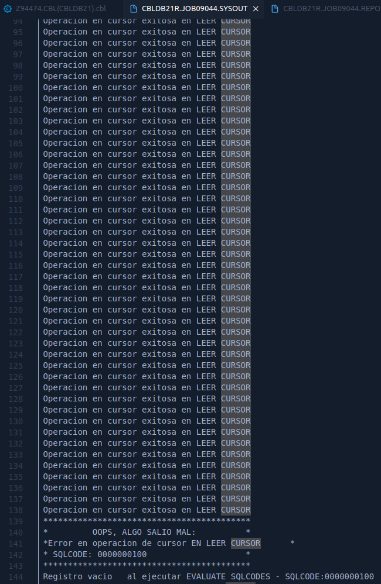

# Práctica 10 - Academia Cobol 2023

***Alumno:** Víctor Lavalle*

***Instructor:** Héctor Camacho*


## Código Fuente

```cobol
      *----------------------------------------------------------------*
       IDENTIFICATION DIVISION.
      *----------------------------------------------------------------*
       PROGRAM-ID.    CBLDB21
       AUTHOR.        Victor Lavalle.

      *________________________________________________________________*
      *                                                                *
      *                     "Practice 10"                               *
      *                                                                *
      * Instructions: Practice UPDATES and COMMITS                     *
      *                                                                *
      *________________________________________________________________*


      *----------------------------------------------------------------*
       ENVIRONMENT DIVISION.
      *----------------------------------------------------------------*
       CONFIGURATION SECTION.
       INPUT-OUTPUT SECTION.
       FILE-CONTROL.
           SELECT REPOUT
                  ASSIGN TO UT-S-REPORT.


      *----------------------------------------------------------------*
       DATA DIVISION.
      *----------------------------------------------------------------*
       FILE SECTION.
       FD  REPOUT
               RECORD CONTAINS 30 CHARACTERS
               LABEL RECORDS ARE OMITTED
               DATA RECORD IS REPREC.

       01 REPREC.
          05 ACCT-ID-O              PIC X(08).
          05 FILLER                 PIC X(07) VALUE SPACES.
          05 ACCT-NAME-O            PIC X(15).


       WORKING-STORAGE SECTION.
       01 FLAGS.
          05 BANDERA-CURSOR         PIC X     VALUE SPACE.
             88 FIN-CURSOR                    VALUE 'Y'.
             88 NO-FIN-CURSOR                 VALUE 'N'.
      *****************************************************
                EXEC SQL INCLUDE SQLCA  END-EXEC.
      *****************************************************
       01 UD-ERROR-MESSAGE          PIC X(80) VALUE SPACES.
       01 SQLCODES.
          05 SQLCODE0               PIC S9(9) COMP-5
                                              VALUE 0.
          05 SQLCODE100             PIC S9(9) COMP-5
                                              VALUE 100.

      *****************************************************
      * DECLARACION SQL DE LA TABLA                       *
      *****************************************************
                EXEC SQL DECLARE Z94474T TABLE
                        (ACCTNO CHAR(8) NOT NULL,
                         LIMIT DECIMAL(9,2) ,
                         BALANCE DECIMAL(9,2) ,
                         SURNAME CHAR(20) NOT NULL,
                         FIRSTN CHAR(15) NOT NULL,
                         ADDRESS1 CHAR(25) NOT NULL,
                         ADDRESS2 CHAR(20) NOT NULL,
                         ADDRESS3 CHAR(15) NOT NULL,
                         RESERVED CHAR(7) NOT NULL,
                         COMMENTS CHAR(50) NOT NULL)
                END-EXEC.
      *****************************************************
      * SQL CURSORS                                       *
      *****************************************************
                EXEC SQL DECLARE CURTABLE CURSOR WITH HOLD FOR
                         SELECT ACCTNO, FIRSTN
                         FROM Z94474T
                         ORDER BY ACCTNO ASC
                 END-EXEC.

      *****************************************************
      * VARIABLES HOST EN DONDE RECIBIMOS LA TABLA        *
      *****************************************************
       01 VARIABLES-HOST.
          02 ACCT-ID                PIC X(08).
          02 ACCT-NAME              PIC X(15).

       01 VARIABLES.
          05 WSV-PARG-NAME          PIC X(17).
          05 WSV-TEMP-NAME          PIC X(12).
          05 WSV-TEMP-ACCTNO        PIC X(08).

       01 COUNTERS.
          05 WSV-COUNT-REC          PIC 9(01) VALUE 0.
          05 WSC-COUNT-LIMIT        PIC 9(01) VALUE 9.


       01 NAME-RECORDS.
          05 WSC-NAME-ASAEL         PIC X(06) VALUE 'Asael'.
          05 WSC-NAME-DIANA         PIC X(12) VALUE 'Diana Brenda'.
          05 WSC-NAME-JORGE         PIC X(05) VALUE 'Jorge'.
          05 WSC-NAME-ANDREA        PIC X(06) VALUE 'Andrea'.
          05 WSC-NAME-CARINA        PIC X(07) VALUE 'Carina'.


       01 LOG-MESSAGES.
          05 WSV-LOG-MESSAGE        PIC X(80) VALUE SPACES.
          05 QMLOG-FD               PIC S9(4) BINARY
                                              VALUE 0.
          05 QMLOG-RECORD           PIC X(80) VALUE SPACES.


       01 PARAGPH-NAMES.
          05 WSC-OPEN-CUR           PIC X(13) VALUE 'ABRIR CURSOR'.
          05 WSC-READ-CUR           PIC X(11) VALUE 'LEER CURSOR'.
          05 WSC-CLOSE-CUR          PIC X(13) VALUE 'CERRAR CURSOR'.
          05 WSC-EVAL-CODE          PIC X(17) VALUE
                'EVALUATE SQLCODES'.
          05 WSC-MAIN-PRO           PIC X(17) VALUE
                'PROCESO PRINCIPAL'.
          05 WSC-UPDATE-NAME        PIC X(11) VALUE
                'UPDATE-NAME'.


       01 ERROR-MESSAGES.
          05 WSC-ERR-MSG-CUR        PIC X(28) VALUE
                "Error en operacion de cursor".

          05 WSC-ERR-MSG-NOT-FOUND  PIC X(22) VALUE
                "Registro no encontrado".

          05 WSC-ERR-MSG-EMPTY      PIC X(16) VALUE
                "Registro vacio".

          05 WSC-ERR-MSG-PARG       PIC X(16) VALUE
                "Error en parrafo".


       01 SUCCESS-MESSAGES.
          05 WSC-SUC-MSG-UPD        PIC X(21) VALUE
                "Actualizacion exitosa".

          05 WSC-SUC-MSG-DEL        PIC X(19) VALUE
                "Eliminacion exitosa".

          05 WSC-SUC-MSG-INS        PIC X(17) VALUE
                "Insercion exitosa".

          05 WSC-SUC-MSG-COMMIT     PIC X(14) VALUE
                "Commit exitoso".

          05 WSC-SUC-MSG-ROLLBACK   PIC X(16) VALUE
                "Rollback exitoso".

          05 WSC-SUC-MSG-READ       PIC X(15) VALUE
                "Lectura exitosa".

          05 WSC-SUC-MSG-CUR        PIC X(27) VALUE
                "Operacion en cursor exitosa".

      *****************************************************
      * Print format for the report
      *****************************************************
       01 BREAKLINE.
          05 BLANK-SPACE            PIC X(50) VALUE ALL " ".

       01 HEADER-1.
          05 FILLER                 PIC X(09) VALUE 'Realizo: '
           .
          05 WSV-AUTHOR             PIC X(06).

       01 HEADER-2.
          05 FILLER                 PIC X(11) VALUE
                'Num. Cuenta'.
          05 FILLER                 PIC X(04) VALUE SPACES.
          05 FILLER                 PIC X(06) VALUE
                'Nombre'.

      *----------------------------------------------------------------*
       PROCEDURE DIVISION.
      *----------------------------------------------------------------*
       EMPIEZO-PROGRAMA.
           OPEN OUTPUT REPOUT.
           SET NO-FIN-CURSOR TO TRUE
           PERFORM PROCESO-PRINCIPAL.

       FIN-PROGRAMA.
           CLOSE REPOUT.
           GOBACK.


       PROCESO-PRINCIPAL.
           PERFORM ESCRIBE-ENCABEZADO

           PERFORM ABRO-CURSOR

           PERFORM LOOP-ASAEL  UNTIL WSV-COUNT-REC = WSC-COUNT-LIMIT
           PERFORM RESET-COUNTER

           PERFORM LOOP-DIANA  UNTIL WSV-COUNT-REC = WSC-COUNT-LIMIT
           PERFORM RESET-COUNTER

           PERFORM LOOP-JORGE  UNTIL WSV-COUNT-REC = WSC-COUNT-LIMIT
           PERFORM RESET-COUNTER

           PERFORM LOOP-ANDREA UNTIL WSV-COUNT-REC = WSC-COUNT-LIMIT
           PERFORM RESET-COUNTER

           PERFORM LOOP-CARINA UNTIL WSV-COUNT-REC = WSC-COUNT-LIMIT
           PERFORM RESET-COUNTER

           PERFORM CIERRO-CURSOR.

           PERFORM ABRO-CURSOR
           PERFORM LOOP-CURSOR UNTIL FIN-CURSOR
           PERFORM CIERRO-CURSOR.


      ***************************************************
      * Paragraphs to manipulate the cursors            *
      ***************************************************

       LOOP-CURSOR.
           PERFORM ESCRIBE-REPORTE.
           PERFORM LEO-CURSOR.


       ABRO-CURSOR.
           EXEC SQL
                OPEN CURTABLE
                END-EXEC.

           MOVE WSC-OPEN-CUR TO WSV-PARG-NAME

           PERFORM QMLOG-OPEN-CURSOR.


       LEO-CURSOR.
           EXEC SQL
                FETCH CURTABLE
                INTO :VARIABLES-HOST
                END-EXEC

           MOVE WSC-READ-CUR TO WSV-PARG-NAME

           PERFORM QMLOG-READ-CURSOR.


       CIERRO-CURSOR.
           EXEC SQL
                CLOSE CURTABLE
                END-EXEC.

           MOVE WSC-OPEN-CUR TO WSV-PARG-NAME

           PERFORM QMLOG-CLOSE-CURSOR.


      ***************************************************
      * Paragraphs to hanlde the counter                *
      ***************************************************
       SUM-COUNTER.
           ADD 1 TO WSV-COUNT-REC.

       RESET-COUNTER.
           MOVE 0 TO WSV-COUNT-REC.


      ***************************************************
      * Paragraphs to print out the report of the data  *
      ***************************************************
       ESCRIBO-AUTOR.
           MOVE 'Victor' TO WSV-AUTHOR.
           WRITE REPREC FROM HEADER-1.


       ESCRIBE-REPORTE.
           INITIALIZE REPREC
           MOVE ACCT-NAME TO ACCT-NAME-O
           MOVE ACCT-ID TO ACCT-ID-O
           WRITE REPREC AFTER ADVANCING 1 LINES.


       ESCRIBE-ENCABEZADO.
           PERFORM ESCRIBO-AUTOR
           WRITE REPREC FROM BREAKLINE AFTER ADVANCING 1 LINES
           WRITE REPREC FROM HEADER-2
           WRITE REPREC FROM BREAKLINE.


      ****************************************************
      * The EVALUATE-SQLCODES subroutine evaluates the   *
      * SQLCODE value and sets flags accordingly.        *
      ****************************************************
       EVALUATE-SQLCODES.

           EVALUATE SQLCODE
           WHEN SQLCODE0
                SET NO-FIN-CURSOR TO TRUE
           WHEN SQLCODE100
                SET FIN-CURSOR TO TRUE
                MOVE WSC-EVAL-CODE TO WSV-PARG-NAME
                DISPLAY WSC-ERR-MSG-EMPTY
                        ' al ejecutar '
                        WSV-PARG-NAME
                        ' - SQLCODE:'
                        SQLCODE
           WHEN OTHER
                PERFORM SQL-ROLLBACK
                DISPLAY WSC-SUC-MSG-ROLLBACK
                        ' al ejecutar '
                        WSV-PARG-NAME
                        ' - SQLCODE:'
                        SQLCODE
                STOP RUN
           END-EVALUATE.


      ****************************************************
      * Root function that calls the other function below*
      ****************************************************
       UPDATE-RECORDS.

           PERFORM LEO-CURSOR

           IF SQLCODE = SQLCODE0
              PERFORM UPDATE-NAME
              PERFORM SUM-COUNTER
           END-IF.


      ****************************************************
      * Update the state to New York to the best clients *
      ****************************************************
       UPDATE-NAME.
           EXEC SQL
                UPDATE Z94474T
                SET FIRSTN = :WSV-TEMP-NAME
                WHERE ACCTNO = :ACCT-ID
           END-EXEC

           MOVE WSC-UPDATE-NAME TO WSV-PARG-NAME

           PERFORM QMLOG-UPDATE.

      ****************************************************
      *Pargragphs to change the name to the temp variable*
      ****************************************************
       UPDATE-NAME-ASAEL.
           MOVE WSC-NAME-ASAEL TO WSV-TEMP-NAME.

       UPDATE-NAME-DIANA.
           MOVE WSC-NAME-DIANA TO WSV-TEMP-NAME.

       UPDATE-NAME-JORGE.
           MOVE WSC-NAME-JORGE TO WSV-TEMP-NAME.

       UPDATE-NAME-ANDREA.
           MOVE WSC-NAME-ANDREA TO WSV-TEMP-NAME.

       UPDATE-NAME-CARINA.
           MOVE WSC-NAME-CARINA TO WSV-TEMP-NAME.

      ****************************************************
      * Pargragphs to change he names every  9 records   *
      ****************************************************
       LOOP-ASAEL.
           PERFORM UPDATE-NAME-ASAEL
           PERFORM UPDATE-RECORDS
           PERFORM SQL-COMMIT.


       LOOP-DIANA.
           PERFORM UPDATE-NAME-DIANA
           PERFORM UPDATE-RECORDS
           PERFORM SQL-COMMIT.


       LOOP-JORGE.
           PERFORM UPDATE-NAME-JORGE
           PERFORM UPDATE-RECORDS
           PERFORM SQL-COMMIT.


       LOOP-ANDREA.
           PERFORM UPDATE-NAME-ANDREA
           PERFORM UPDATE-RECORDS
           PERFORM SQL-COMMIT.


       LOOP-CARINA.
           PERFORM UPDATE-NAME-CARINA
           PERFORM UPDATE-RECORDS
           PERFORM SQL-COMMIT.


      ****************************************************
      * SQL-COMMIT procedure to commit the changes       *
      ****************************************************
       SQL-COMMIT.
           EXEC SQL
                COMMIT
           END-EXEC.


      ****************************************************
      * SQL-ROLLBACK procedure to restore data           *
      ****************************************************
       SQL-ROLLBACK.
           EXEC SQL
                ROLLBACK
           END-EXEC.

      ****************************************************
      * Functions to print a log of the program running  *
      ****************************************************
       QMLOG-ERROR.
           DISPLAY '******************************************'.
           DISPLAY '*         OOPS, ALGO SALIO MAL:          *'
           DISPLAY '*' WSC-ERR-MSG-CUR ' EN ' WSV-PARG-NAME '*'
           DISPLAY '* SQLCODE: ' SQLCODE '                    *'
           DISPLAY '******************************************'.


       QMLOG-READ-CURSOR.
           EVALUATE SQLCODE
           WHEN SQLCODE0
                DISPLAY WSC-SUC-MSG-CUR ' en ' WSV-PARG-NAME
           WHEN OTHER
                PERFORM QMLOG-ERROR
                PERFORM EVALUATE-SQLCODES
           END-EVALUATE.


       QMLOG-OPEN-CURSOR.
           EVALUATE SQLCODE
           WHEN SQLCODE0
                DISPLAY WSC-SUC-MSG-CUR ' en ' WSV-PARG-NAME
           WHEN OTHER
                PERFORM QMLOG-ERROR
                PERFORM EVALUATE-SQLCODES
           END-EVALUATE.


       QMLOG-CLOSE-CURSOR.
           EVALUATE SQLCODE
           WHEN SQLCODE0
                DISPLAY WSC-SUC-MSG-CUR ' en ' WSV-PARG-NAME
           WHEN OTHER
                PERFORM QMLOG-ERROR
                PERFORM EVALUATE-SQLCODES
           END-EVALUATE.


       QMLOG-UPDATE.
           EVALUATE SQLCODE
           WHEN SQLCODE0
                DISPLAY WSC-SUC-MSG-UPD
                        ' en '
                        WSV-PARG-NAME
                        ' - SQLCODE: '
                        SQLCODE
           WHEN OTHER
                DISPLAY WSC-ERR-MSG-PARG ' ' WSV-PARG-NAME ' '
                PERFORM EVALUATE-SQLCODES
           END-EVALUATE.

```


## Salida





### Base de datos - TN3270


